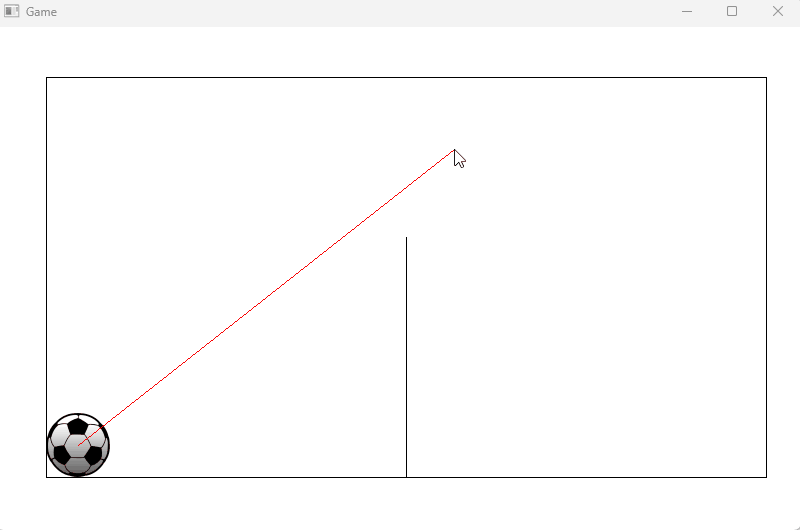

# Projectile Program with Nature Physics with C and SDL Library
[2017-06-03] A Simple Projectile Program which has Nature Physics

### 프로그램 개발 환경
- Language : C
- OS : Microsoft Windows 10
- IDE : Microsoft Visual Studio 2017 15.0

### 기능 설명
- C와 SDL 라이브러리를 사용하여 간단하게 제작한 자연 현상 물리 법칙 구현 프로그램
- 자연 현상을 설명할 수 있는 몇 가지 물리 법칙을 구현하였다. (아래 항목 참고)
- `[마우스 왼쪽 버튼]`을 클릭하면 **축구공 객체**가 추가되며, 이 객체는 자연 현상의 물리 법칙을 적용 받는다.

### 구현한 물리 법칙
① 중력 효과 (Gravity Effect)

② 땅, 수직벽과의 충돌 효과 (Collision Effect Between The Ball And The Ground, Vertical Walls)

③ 펜스와의 충돌 효과 (Collision Effect Between The Ball And The Fence)

④ 땅과의 마찰 효과 (Friction Effect Between The Ball And The Ground)

⑤ 발사 지연 시간 (Delay Time of Shooting Balls)

### 프로그램 실행 방법
- Visual Studio에 **[SDL 라이브러리](https://github.com/libsdl-org/SDL/releases)** 연동

### 실행 화면

